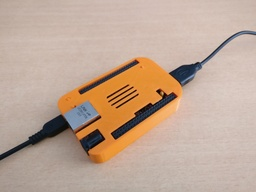
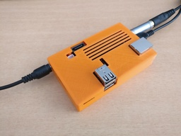
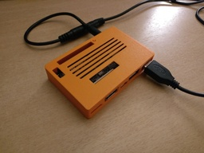
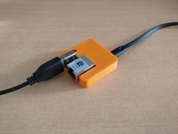
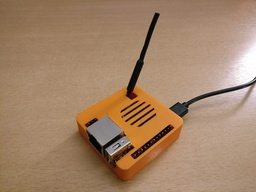
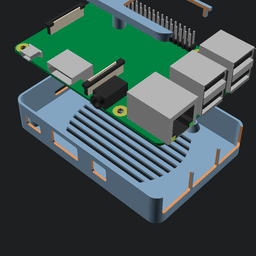
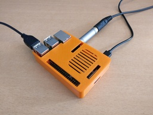

ShimonBox
=========

ShimonBox is an [OpenSCAD][openscad] project aiming at providing
semi-automatically generated 3D printable cases for development boards.

Note: the project is still experimental so the cases may not fit properly the
boards yet. Refer to the "Status" column below.

[openscad]: http://www.openscad.org

Supported boards
----------------

| Board name                                   | Preview                                          |
| -------------------------------------------- | ------------------------------------------------ |
| [BeagleBone Black](boards/bbb.scad)          |           |
| [Cubieboard](boards/cubieboard.scad)         |          |
| [Hikey (LeMaker)](boards/hikey.scad)         |                    |
| [NanoPi Neo 2](boards/nanopi_neo2.scad)      |       |
| [Orange Pi Zero](boards/orangepi_zero.scad)  |   |
| [Raspberry Pi 3](boards/rpi3.scad)           |            |

Corresponding cases
-------------------

| Board name                                   | Preview                                          | Status                                                                                   |
| -------------------------------------------- | ------------------------------------------------ | ---------------------------------------------------------------------------------------- |
| [BeagleBone Black](cases/bbb.scad)           |            | [VERIFIED](pics/bbb.jpg):                    |
| [Cubieboard](cases/cubieboard.scad)          |           | [VERIFIED](pics/cubieboard.jpg):             |
| [Hikey (LeMaker)](cases/hikey.scad)          |                     | [VERIFIED](pics/hikey.jpg):                           |
| [NanoPi Neo 2](cases/nanopi_neo2.scad)       |        | [VERIFIED](pics/nanopi_neo2.jpg):        |
| [Orange Pi Zero](cases/orangepi_zero.scad)   |    | [VERIFIED](pics/orangepi_zero.jpg):  |
| [Raspberry Pi 3](cases/rpi3.scad)            |             | [VERIFIED](pics/rpi3.jpg):                    |

Usage
-----

To make all the `.stl` files, run `make`. The resulting files will be found in
the [cases/](cases) directory.

If you're looking at building individual parts, you can use `make
cases/<board>-<part>.stl` where `<board>` is the board name and `<part>` is the
part you want to build (`bottom`, `top`, or `button`).
